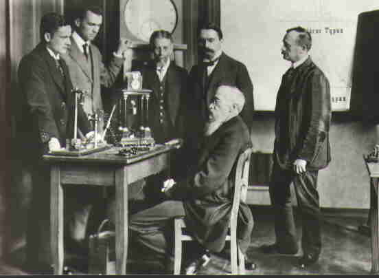
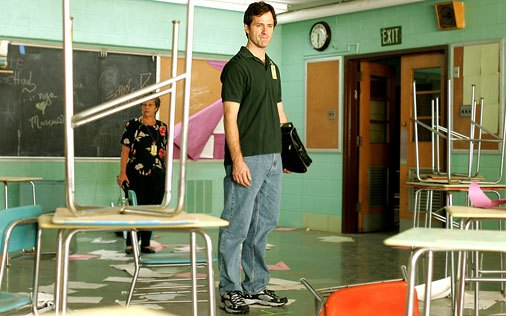

A melhor forma de adentrar o estranho mundo do ensino obrigatório é através dos livros. Eu sempre soube que livros de verdade e livros didáticos eram diferentes, mas eu nunca tomei consciência das particularidades até que um dia eu me cansei do Currículo sem sentido de Inglês e decidi ensinar <i>Moby Dick</i> para as turmas regulares do oitavo ano. Eu descobri que a baleia branca era grande demais pra caber nos espaços de quarenta e cinco minutos de uma <i>high school</i>. Não dava para “encaixá-la”. Mas os editores da versão escolar de <i>Moby Dick</i> tinham providenciado um pacote de perguntas pré-fabricadas e interpretações próprias. Cada capítulo começava e terminava com uma montanha dessas intervenções. Eu percebi que a edição escolar não era um livro de verdade, e sim doutrinação disfarçada. O livro tinha se blindado à prova de professores e de alunos.

 Essa fragmentação em quebra-cabeça, projetada para se fazer do local de trabalho um lugar à salvo dos empregados, é normalmente creditada à obra de genialidade maligna, "Princípios de Administração Científica", de Frederick Taylor, escrita na virada para o século XX. Mas isso está errado. O sistema foi concebido de fato antes da Revolução Americana, na Prússia setecentista, por Frederico o Grande, e aprimorada à perfeição na Prússia do século dezenove após a humilhante derrota por Napoleão em 1806. Um novo sistema de ensino foi o instrumento do qual a vingança prussiana foi moldada, um sistema que reduzia os seres humanos nos seus anos maleáveis em confiáveis partes de máquina, maquinário humano dependente para a missão e valores do Estado. Quando Blucher e os hussardos da morte destruíram Napoleão em Waterloo, o valor do ensino prussiano foi confirmado.

_Federick, o Grande_

Em 1819, a filosofia prussiana havia dado ao mundo o primeiro laboratório de ensino obrigatório. Nesse mesmo ano Mary Shelley escreveu Frankenstein, a história de um intelectual germano-sueco que fabricou um monstro de partes de gente morta: imagino que o ensino obrigatório era o monstro que ela tinha em mente, emblematizado pela claudicante destruição causada por uma criatura sintética procurando por seu criador, uma criatura com a eterna dor das famílias problemáticas.

No século XIX, os laços entre a Prússia e os Estados Unidos eram mais que estreitos, um fato desconhecido nos dias de hoje que se tornou vergonhoso demais para nós durante as Grandes Guerras e portanto foi removida dos livros de história. As bolsas de estudo americanas eram quase exclusivamente alemãs nos níveis superiores, outro fato ausente por conveniência da história popular. De 1814 a 1900, mais de cinquenta mil jovens das mais proeminentes famílias americanas fizeram a peregrinação à Prússia e a outras partes da Alemanha para estudar sob os seus novos sistemas de ensino superiores baseados em pesquisa em vez de “educação”. Dez mil trouxeram seus PhD’s de volta para um Estados Unidos até então livre de credenciais, antecipando a maior parte do trabalho técnico e intelectual.

A educação prussiana era a obsessão nacional entre os líderes políticos, industriais, clérigos e universitários. Em 1845, o imperador prussiano foi inclusive solicitado para adjudicar sobre a fronteira entre o Canadá e os Estados Unidos! Praticamente todo pai fundador do ensino obrigatório americano foi à Prússia para estudar em primeira mão nas  salas de aula cronometradas. O Sétimo relatório do <i>Boston Committee</i> de 1844 de Horace Mann foi basicamente dedicado a elogiar as conquistas prussianas e como elas deviam ser as nossas. O livro de Victor Cousin sobre o ensino prussiano representava a opinião de nosso país nessa mesma época. Quando, apenas um quarto século depois, a Prússia arrasou a França numa breve guerra e realizou o milagre de unificar a Alemanha, ficou claro que a forma de unir as nossas classes imigrantes – o que desesperadamente tentamos fazer – foi através da escola prussiana.

Em 1905, os americanos treinados na Prússia ou americanos como John Dewey, aprendizes de hábeis mãos prussianas, estavam no comando de cada uma das instituições de treinamento científico: o Teacher’s College da Universidade de Columbia, a Universidade de Chicago, Johns Hopkins, a Universidade de Wisconsin e Stanford. A dominação da visão prussiana e a dominação mais ampla da filosofia e pedagogia alemã foi um fato consumado entre os líderes do ensino americano.

Você deveria se preocupar com isso pelo simples motivo de que as práticas alemãs eram usadas aqui para justificar a remoção de material intelectual dos currículos; o que pode explicar porque seus filhos não conseguem pensar. Esse é o jeito prussiano – treinar apenas um pequeno quadro de líderes a pensar.

De todos os homens cujas visões empolgaram os arquitetos da máquina americana de escolas prussionizadas, o mais proeminente foi um filósofo alemão chamado Hegel e um médico alemão chamado Wilhelm Wundt. No laboratório de Wundt as técnicas de psicofísica (o que hoje poderíamos chamar de “psicologia experimental”) foram refinadas. Graças a seu trabalho, foi preciso pouca imaginação para visualizar o surgimento de um incrível novo mundo – já que Wundt havia demonstrado de forma convincente para os seus alunos americanos que as pessoas eram apenas máquinas complexas!

_Wilhelm Wundt (sentado)_

Homem ou máquina? As implicações eram animadoras, prometendo liberação das velhas algemas da tradição, cultura, moralidade e religião. Ajuste se tornou a palavra de ordem das escolas e instituições de assistência social. G. Stanley Hall, um dos protegidos pessoais de Wundt (que enquanto professor na John Hopkins havia inoculado seu principal pupilo, John Dewey, com o vírus germânico) juntava-se a Thorndike, seu colega com treinamento germânico da Universidade de Columbia, a advogar pelos testes nacionais padronizados. Hall astutamente patrocinou e promoveu uma tour americana para o médico austríaco Sigmund Freud para que ele pudesse popularizar sua teoria de que os pais e a família eram basicamente a causa de todos os desajustes – mais uma razão para remover suas engrenagens para o bem da escola.

Na mentes dos discípulos da escola de pensamento alemã, a educação científica era antes de tudo uma forma de forçarem as pessoas a se encaixar. Com um objetivo tão “técnico” em mente, o curso futuro das escolas americanas estava dado, e com o apoio financeiro de fundações – especialmente as das famílias Rockefeller e Carnegie – foram estabelecidas novas faculdades científicas para moldar professores. Na Prússia elas foram corretamente chamadas de “Seminários de Professores”, mas aqui os religiosos seculares foram mais discretos: os sacerdotes dos profissionais treinados resguardaram a nova Igreja-escola ao transformar o seu texto canônico em lei. Assim, a Torá do ensino obrigatório do século vinte encontraria a sua Arca em 1895, pouco antes do reinado de William Torrey Harris como Comissário de Educação.

O treinamento de professores na Prússia foi fundado sob três premissas, que os Estados Unidos posteriormente tomaram emprestado. A primeira delas era que o Estado é soberano, o único pai verdadeiro das crianças. O seu corolário era que os  pais biológicos são os inimigos de suas crias. Quando o alemão Froebel inventou o jardim de infância, não era um jardim para crianças que ele tinha em mente e sim um jardim de crianças, em que os professores indicados pelo Estado eram os jardineiros. O jardim de infância foi feito para proteger as crianças de suas próprias mães.

A segunda premissa do ensino prussiano é que treinamento intelectual não é o propósito do ensino público – e sim obediência e subordinação. Na verdade, treinamento intelectual irá invariavelmente subverter a obediência a não ser que seja rigidamente controlada e distribuída como uma recompensa pela obediência. Se a vontade puder ser contida, todo o resto seguirá. Basta lembrar que a contenção da vontade era lógica central da criação infantil entre os nossos colonos puritanos, e você entenderá a afinidade natural que existe entre as sementes prussianas e solo puritano – em cuja agricultura nossas leis cultivam o ensino obrigatório. A ferramenta mais conhecida para conter a vontade dos jovens, praticada durante séculos pelas elites inglesas e alemãs, era a separação dos pais e filhos nos primeiros anos.  Nesse momento a separação já era uma instituição assegurada pelo poder policial do Estado. Mas ainda não era suficiente para impor obediência pela intimidação. A criança deve ser levada a amar o seu pai postiço. Quando o protagonista de "1984" de George Orwell percebe que ele ama o Grande Irmão depois de trair sua amante pelo Estado, nós temos uma materialização dramática do destino sexual da escola prussiana; ela cria a vontade de entregar a sua própria família, amigos, cultura, e religião para a sua nova amada: o Estado. Doze anos de punições arbitrárias e recompensas no confinamento de uma sala de aula é tempo suficiente para condicionar qualquer criança a acreditar que aquele que aquele que detém o poder da caneta vermelha é o seu verdadeiro pai, e aqueles que controlam o sinal devem ser deuses.

A terceira premissa do treinamento prussiano é a de que a sala de aula e o local de trabalho devem ser emburrecidos em procedimentos simples de tal maneira que qualquer pessoa, até a mais lenta, possa memorizar e operar. Isso resolve o histórico dilema da liderança: uma força de trabalho desobediente pode ser rapidamente substituída, sem prejuízo para a produção, caso os trabalhadores optem por repetição, e não cérebro, para funcionar. Essa estratégia deu certo recentemente durante a greve nacional dos controladores de tráfego aéreo, quando a toda a força dos supostos <i>“experts”</i> foi substituída do dia pra noite por pessoas treinadas de última hora. Não houve aumento de acidentes! Se qualquer pessoa pode fazer certo trabalho, não existe razão para lhes  pagar muito a não ser para garantir a lealdade e dependência do empregado – um tipo de amor extorsivo igualmente comuns aos maus pais. 

No chão-de-fábrica da sala de aula, tudo é reduzido a porções sob o rígido controle administrativo. Isso permite que o progresso seja quantificado em rankings para o acompanhamento dos alunos ao longo de suas carreiras – a grande ironia é que não é o crescimento intelectual que as notas e os relatórios medem, e sim a obediência à autoridade. É por isso que a publicação da falta de correlação entre desempenho e as notas de testes padronizados não encerram o uso desse mecanismo de vigilância. O que elas medem na verdade é a cordialidade do estudante, e isso eles fazem com precisão. É útil dizer quem é dócil ou não? Você que me diga. 

Finalmente, se os trabalhadores ou alunos têm pouca ou nenhuma ideia de como eles se encaixam no todo, se eles são incapazes de tomar decisões, cultivar comida, construir uma casa ou um barco, ou até se entreterem, então o stablishment político e econômico reinará porque só uma liderança cuidadosamente testada e experiente saberá como as coisas funcionam. Cidadãos leigos nem saberão quais questões devem ser levantadas, muito menos onde encontrar as respostas. Isso é pedagogia sofisticada de fato, mas muito diferente da que a mãe e o pai esperavam quando mandaram o Júnior pra escola. Isso é o que a Direita religiosa quer dizer quando afirma que o ensino é a religião secular. Se você consegue pensar independentemente do pré-estabelecido e receber sabedoria, você chegará, sem dúvida, à mesma conclusão, seja lá qual for a sua crença interna. O ensino é a religião oficial do Estado; e de jeito nenhum é um veículo neutro para a aprendizagem.

A loucura a qual submetemos nossas crianças deveria ter sido motivo suficiente para impedi-la, uma vez que ela se manifestava em crescente patologia social. Porém um movimento importante impediu a ação corretiva: o ensino se tornou o maior mercado de todos. De repente havia cargos, títulos, carreiras, prestígio e contratos para proteger. Enquanto país, nós nunca tivemos o luxo de um consenso religioso ou cultural. Enquanto Estado em construção, nós tivemos apenas o consenso econômico: a unidade é alcançada ao fazer todo mundo querer ficar rico, ou fazê-los invejosos daqueles que são. 

Na medida em que uma explêndida máquina econômica como a do ensino funcionava, só um louco tentaria pará-la ou não aproveitar a sua ascensão. Claro, os empregos ainda não eram bem remunerados (ainda que os contratantes tenham feito e ainda façam fortunas), mas sob um olhar mais cuidadoso eles pagavam mais que a maioria. E a segurança para os obedientes era perfeita porque a instituição oferecia o melhor seguro contra a perigosa mobilidade social (característica de uma sociedade nova) antes dela ser verificada. Horace Mann, Henry Bernard, William Harris, Edward Thorndike, William James, John Dewey, Stanley Hall, Charles Judd, Ellwood Cubberly, James Russell – todos os grandes educadores da história americana – fizeram promessas eternas aos industriais e às mais proeminentes famílias americanas de que se fosse dado apoio ao novo esquema prussiano, as perspectivas de uma revolução seriam banidas. (E que grande ironia a de que, numa nação revolucionária, o motivador mais eficiente da liderança era garantir que outra revolução pudesse ser prevenida!)

As escolas seriam a apólice de seguros para uma nova ordem industrial que, como um infeliz subproduto de suas operações, destruiriam a família americana, o pequeno fazendeiro, a paisagem, o ar, a água, a base religiosa da vida comunitária, o pacto de que os americanos podem ascender e cair pelos próprios esforços. Essa ordem industrial destruiria a própria democracia, e a promessa feita aos homens e mulheres comuns de que se eles um dia fossem encurralados pelos seus líderes, eles mesmos poderiam mudar as coisas em seu favor pelas urnas. 

Espero que você entenda agora que essa teoria prussiana do ambiente de trabalho e das escolas não é apenas excentricidade histórica, mas necessária para explicar a estrutura padrão dos livros didáticos e procedimentos de sala de aula, que passa longe da forma que as pessoas de fato aprendem. Explica o vago interesse que as fundações Rockefeller e Carnegie tiveram em moldar o ensino obrigatório segundo o modelo padronizado das fábricas, e lança luz em muitos misteriosos aspectos da moderna cultura americana: por exemplo, por que, numa democracia, os cidadãos, ao nascerem, não podem ser automaticamente registrados para votar, de uma vez por todas?

O ensino obrigatório tem sido, desde o seu início, um esquema de doutrinação para o novo conceito de homem-massa, um elemento importante advindo da criação do proletariado. De acordo com Augusto Comte (sem dúvida, o padrinho do ensino científico), você poderia criar uma classe proletária útil ao desfazerem os laços entre as crianças e suas famílias, suas comunidades, seu Deus, e elas mesmas. Você se lembra da crença de William Harris de que a auto-alienação era a chave para um ensino bem sucedido? Claro que é. Essas conexões devem ser quebradas para criar uma cidadania dependente porque, se deixada viva, as lealdades que elas alimentam são imprevisíveis e incontroláveis. As pessoas que possuem esse tipo de conexão diriam: “nem morto.” Mas como os estados podem operar da mesma forma?

 Pense na escola pública como uma grande clínica de comportamento projetada para criar um  proletariado inofensivo, sendo a maior parte dele composta de um proletariado profissional de advogados, médicos, engenheiros, gerentes, funcionários públicos e professores. Esse proletariado profissional, mais desamparado que os pobres, é mantida refém pelo seu vício pela riqueza e segurança, e pelo medo de que o monopólio autorizado seja alterado com a mudança de governo. O principal serviço que ela presta – conselho – está contaminado pelo interesse pessoal. Estamos todos morrendo disso, o proletariado profissional mais rápido que qualquer um. São os filhos deles que cometem suicídio mental com regularidade, e não os filhos do pobres.

 Imprimir questões no final dos capítulos é um jeito deliberado de emburrecer um texto e torná-lo a prova de professores. Fizemos isso por tanto tempo que ninguém examina as premissas sob as práticas ou vê a redução permanente no domínio mental que ela causa. Assim como professores nunca deveriam ser de fato cientistas, e professores de literatura não deveriam ser pensadores originais que levantassem perguntas originais do texto.

 Em 1926, Bertrand Russell disse casualmente que os Estados Unidos foram a primeira nação na história humana a deliberadamente negar às suas crianças as ferramentas para o pensamento crítico; na verdade, a Prússia foi a primeira, nós fomos o segundo. A edição escolar de Moby Dick levantou todas as perguntas certas, e por isso eu tive de jogar fora. Livros de verdade não fazem isso. Eles permitem que os leitores participem ativamente com as suas próprias perguntas. Livros que te mostram as melhores perguntas a serem feitas não são apenas estúpidos, eles machucam o intelecto sob o pretexto de ajudá-lo, assim como os testes padronizados fazem.
Escolas bem-educadas, assim como os livros, são muito parecidos. Propagandistas há um século sabem que as pessoas educadas em escolas são mais fáceis de liderar que as ignorantes – assim confirmado por Dietrich Bonhoeffer em seus estudos sobre o nazismo. É muito útil para algumas pessoas que a nossa forma de ensino diga a criança o quê, como e quando pensar. É muito útil para alguns grupos que as crianças estejam dependentes de experts, para reagirem a títulos em vez de julgarem os homens e mulheres que se escondem por trás dos títulos. Não é muito saudável para as famílias e a comunidade, culturas e religião. Mas a escola não tem mais a ver com essas coisas: é por isso que nós não as temos por perto mais. Você pode agradecer o ensino público por isso.

**_John Taylor Gatto (1994) The Tyranny of Compulsory Schooling, The Educational Forum_**
