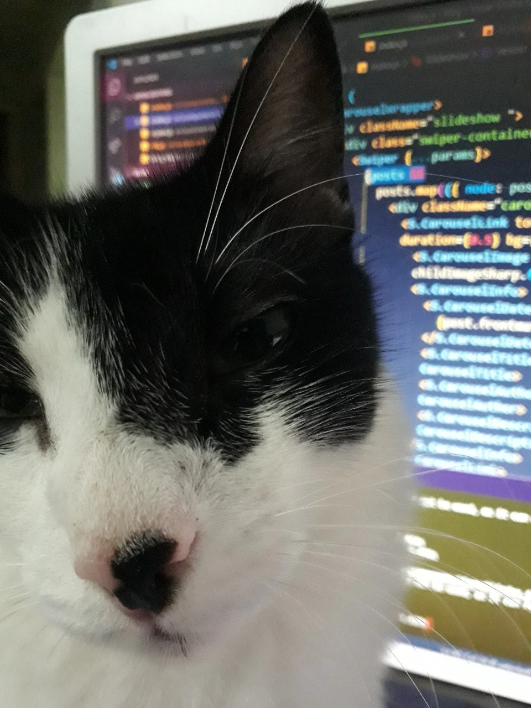
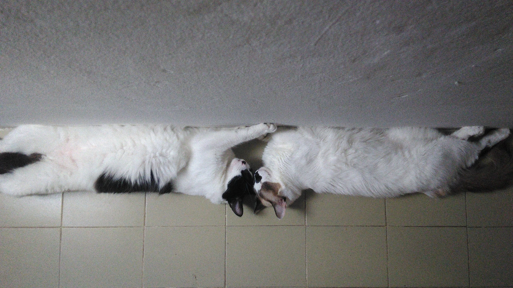
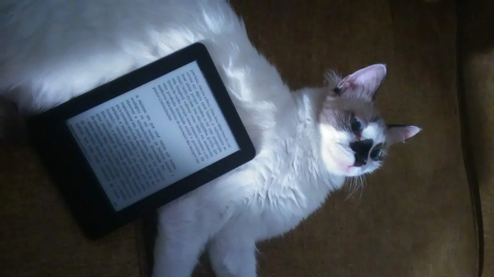

## 17 DE JANEIRO

-- “oi cicero cheguei”

 Feito um milagre, as portas automáticas do Edifício Norcon se abriram para o barulho e o bafo da avenida Dona Constança, de onde um homem abraçado ao seu fiat Uno, de óculos escuros e sorriso parecido com a da foto do <i>WhatsApp</i> me esperava na calçada. Cumprimentamos dentro no carro: 
 -- Opa!
 -- Opa. Tuf! tuf!
 Davam oito e dez da manhã e eu tinha naquele momento exatamente 5 horas para ir e voltar da cidade de Palmares, que fica a uns 170 km de distância de Maceió, na metade do caminho para Recife. É lá onde fica polo regional da Universidade de Pernambuco, onde todos os aprovados no vestibular farão a matrícula, e para onde todos irão quando tiverem de fazer provas e tudo aquilo que se faz em um polo regional. Fazia muitíssimo calor e era aquela sexta-feira o último dia de matrícula. Se o nosso amigo pisasse fundo, talvez conseguiríamos chegar às dez e pouco e fazer a matrícula em tempo suficiente de pegar a van de volta, às 11h, e voltar pra Maceió a tempo do turno da tarde no trampo. Mas nada pode ser tão fácil. 
 -- Mestre, só vou ter que passar lá em cima pra pegar uma menina…
 -- Ah não, tranquilo. 
 -- O foda é que ela é uma ex-namorada de um amigo meu...
 Não entendi o porquê daquele detalhe, estava meio retardado de uma noite mal dormida e não falei nada. Pluguei o fone no ouvido direito.
 -- O outro passageiro deve estar chegando aí...
 Passado um minuto, outro passageiro entra no carro, um rapaz jovem e forte que ia para Recife e trazia um terno numa embalagem:
 -- Bom dia.
 -- bom dia -- partimos.

 O terceiro passageiro foi recolhido num posto de gasolina na avenida Fernandes Lima. Dessa vez, era um cara de uns trinta anos, talvez um pouco mais velho que eu, forte, mas não malhado de academia. Não arriscaria adivinhar profissão dele nem o motivo da viagem. Só sei que agora eu estava ali, forçado a enfiar minhas pernas no vão entre os bancos dianteiros. E assim fomos entrando no bairro da Serraria.
 A tal ex-namorada do amigo do motorista acabou nos dando um pequeno chá-de-cadeira em frente ao condomínio onde morava mas tudo foi perdoado quando ela apareceu. Os caronas ficaram imóveis pra assegurar que o vulto era mesmo de uma mulher classuda. morena com luzes no cabelo, óculos escuros, e uma grande mala rosa. Nem feia nem muito bonita. Perfeita. O sonho do brasileiro médio. Enquanto ela sentava no banco da frente, um moralizador e doce perfume de mulher garantia a assepsia daquele. Dei-lhe pelo retrovisor a cortesia de um alô e seguimos. O motorista parecia mesmo interessado na menina, toda vez que ela falava alguma coisa o nosso amigo desviava o rosto da pista e a olhava fixamente, de um jeito não natural, feito um robô. Mais adiante, talvez para transparecer um ar de caroneiro profissional, ou talvez só para impressionar a moça, o motorista nos aplicou sua playlist de sertanejo, o que me obrigou a aumentar o volume do Spotify.

[logo]: ../static/assets/img/images-09-06/livros.webp

_“...É o mentor do Obama, é o guru do Obama! o qual durante muito tempo se dedicou a implantar a estratégia que aqueles dois outros picaretas inventaram baseado no Saul Alinsky. A teoria era a seguinte: existe a previdência social, a previdência social dá uma lista de direitos que as pessoas têm. No entanto, na prática, só uns 5% das pessoas que teoricamente tem esse direito se apresentam para reivindicar esse direito. Os outros 95 ignoram, ou porque não estão precisando, ou porque...sei lá! por algum motivo. Se a gente fizesse os 95 entrar na fila também...o que que vai acontecer? a Previdência Social vai falir. Falindo a Previdência Social vai falir os bancos. Falindo os bancos a gente vai falir o sistema inteiro. Assim que a gente derruba o sistema. O Obama trabalhou durante anos nesse serviço, empurrando pessoas para explorar a previdência social!_

Estou agora na garupa de um moto-táxi, o transporte mais eficiente de Palmares e que te deixa em qualquer ponto pelo preço universal de 5 reais. Deixamos o posto de gasolina, cruzamos a rodovia, e entramos na cidade rumo ao local de matrícula. Tem que dar certo!

 A escola Maquinista Amaro fica no final de uma rua não asfaltada e cercada por mato, quase no limite da cidade. Perguntei para o moto-táxi se ele poderia me esperar na porta: “Tá”. Trespassei o portão no pique, e avistei uma folha chamex colada na parede com a inscrição em letra cursiva: “Matrícula UPE”, e uma seta apontando para uma sala. Entrei. Entreguei a uma moça simpática os meus documentos, todos separadinhos. Ela percebeu e colaborou com a minha pressa. Assinei um, dois, três papéis. Tudo certo. Ao final, perguntei para uma outra senhora que estava sentada no fundo da secretaria:
 -- Já sabe quando começam as aulas?
 -- Depois do carnaval! -- respondeu.
 -- E as outras informações sobre as aulas: frequência, provas e tal?
 -- A gente vai fazer um grupo no Zap!
 Girei meu corpo em direção à porta, satisfeito com a resposta.
 Na saída, uma surpresa: o moto-táxi tinha sumido. Mas, por sorte, outro passava por ali no mesmo instante:
 -- Amigo, me leva pro ponto de vans? -- perguntei, afivelando o capacete extra. Seguimos.
 Passados alguns segundos, ao longo da rua de terra, surgia, da direção contrária, uma silhueta que foi me tornando familiar:
 -- Ou, ou, ou!
 Não teve jeito. Diante aquele flagrante de infidelidade, dei ao motorista que me conduzia dois reais de consolação e terminei a viagem na garupa daquele que a possuía por direito.
 A verdade é que eu tinha perdido por cinco minutos a van das 11 horas, e a próxima só ia sair ao meio-dia e meia. Eu já tinha, inclusive, alargado meu horário de tolerância e cogitava chegar às três horas da tarde. Perguntei a um rapaz que administrava a garagem por quanto sairia o carro particular fretado para Maceió: “450 reais” ele respondeu. Calei-me.

Descabriado, resolvi dar uma volta pela Rodoviária de Palmares que fica a poucos metros do ponto de vans. Tinha uma hora e meia de espera e comecei a ficar introspectivo. Comprei um picolé. E do saguão de embarque vazio, avistei um elevado, e no topo dele, um casarão fechado com mato crescido e uma inscrição na parede: “Casa de Cultura Hermilo Borba Filho”. -- Meu Deus! -- pensei comigo mesmo -- quem é esse cara e que tipo de cultura se pratica ali? 
 De volta ao ponto de vans. Os veículos chegavam e saíam, as pessoas compravam coca-cola e duas meninas adolescentes saíam de uma portinha estreita. Enquanto esperava o relógio dar doze e meia, uma senhorinha me pediu instruções sobre tecnologia:
 -- Como que eu falo com a minha irmã?
 Pedi-lhe o celular e roteei minha conexão. Devolvi-lhe o aparelho com o aplicativo aberto na conversa da irmã. Empunhando o celular, a senhorinha, que me contou depois ser camareira, gravou um áudio:
 -- Óia, já almocei e tô saindo de Palmares agora e deu tudo certo, graças à Deus! Daqui a pouco chego no hotel pra gente se ver… E fala pro Felipe que de noite eu dou um beijo nele, tchau! 
 Entrei na van satisfeito com a minha boa ação, e com um sentimento de que tudo daria certo. Chegaríamos todos na hora por um milagre dessa van fretada por um adolescente mas guiada pelo Senhor. Com ajuda de um Uber, cheguei à Pajuçara, em Maceió, exatamente às 15h; e a viagem foi, de fato, tranquila e leve, na santa paz de Deus.

## 20 DE JANEIRO

Enfim, formado o grupo do Whatsapp (ou zap) para a alegria de todos.
A primeira mensagem enviada foi um cordial “bom dia”,seguido por outros três e um sticker que dizia: “A Paz de Deus a todos do grupo”. Mais tarde, alguém compartilhou alguns documentos, gramáticas e apostilas para concursos, o que foi não só de grande serventia, mas um raro gesto de solidariedade. Enquanto isso, outra pessoa ventilava a ideia de confeccionarmos uma camisa para o curso, mas não houve quórum suficiente e a ideia não foi pra frente. A certa altura, fiz uma pergunta sobre a frequência das aulas presenciais, mas também fui ignorado.

## 07 DE FEVEREIRO

Enquanto as aulas não começam, deixo aqui um registro antes que o esqueça…
Não tenho opinião formada sobre cotas nos concursos públicos, na verdade, acho tediosa toda essa discussão. O que não me impede de comentar aquilo que me parece óbvio.

 Existe, no vestibular da UPE, cota de vagas para os alunos da rede pública, para aqueles que estudaram integralmente do atual sexto ano ao terceiro ano do ensino médio. Das 30 vagas ofertadas no vestibular 2019 de Letras em Palmares, 6 eram separadas para os cotistas. Sei que um vestibular de graduação à distância voltado a alunos do ensino médio do interior de Pernambuco não é, convenhamos, o concurso mais disputado do mundo. No final das contas sempre vai ter vagas para quem quiser, e quem quiser vai passar. Mesmo assim, me parece que há um erro de calibragem, porque, para todos os cursos do vestibular 2019 e em todos seus pólos regionais, a proporção candidato-vaga entre os cotistas foi, em média, o dobro da concorrência universal. Sou eu que estou doido ou isso mostra que o sistema de cotas quando não é injusto é no mínimo inútil?

Outra coisa...houve uma conversa interessante hoje no grupo da turma no whatsapp:

_-- Gente, pode parecer idiotice, mas vamos aprender gramática no curso? Minha tia fez letras e quase não viu gramática. :(
 -- É pq o curso de letras_ -- respondeu outra caloura mais vivida -- _acredito que assim como o de letras-espanhol, subentende que vc já saiba. (...) Eu sei um pouquinho de gramática, mas gramática é muito difícil (...) quanto mais estudo mais vejo que não sei.
 -- Português é muito difícil mesmo, até os gramáticos às vezes estão levantando novas teorias e se contradizendo.
 -- Aprender espanhol me ajudou muito a conhecer melhor a língua portuguesa._

## 16 DE FEVEREIRO

Estava marcada para hoje, às 9:00, a aula inaugural do Curso de Letras em Palmares. Solenidade esperada por todos os calouros (e, pasmem, por mim inclusive!) com toda aquela cerimônia que se imagina de um primeiro dia: alguém da coordenação receberia os calouros, esclarecendo-os as principais dúvidas do curso, mais tarde, as luzes seriam apagadas para melhor visualizar os slides. Perguntas idiotas seriam feitas. Todo o mundo se veria pela primeira vez e as primeiras afinidades seriam descobertas ao redor da mesa com o prometido <i>coffee break</i>.

Um momento importantíssimo, sem dúvida... pena que não estava lá...

Confesso que matei a primeira aula por causa de uma prévia de Carnaval no sábado, seguida por uma cachaçada adolescente que começou no Pinto da Madrugada, na orla de Ponta Verde, terminou no apartamento de um amigo meu e de Laís. Ainda de noite, totalmente destruído e já na horizontal, juntei minhas últimas forças e enviei ao simpático motorista do aplicativo uma mensagem, mentindo-lhe ao dizer que havia arranjado outra carona de última hora e que precisaria cancelar a viagem. Pedi-lhe as devidas desculpas, mas ele nem me respondeu. Triste...na próxima eu vou.

## 24 DE FEVEREIRO

É domingo de Carnaval e acabo de ler o livro de Osman lins, “Do Ideal à Glória - Problemas Inculturais Brasileiros”, cujo artigo, “O Invencível Hermilo” publicado pouco depois da morte de Hermilo Borba Filho, fez o favor de responder uma dúvida surgida um mês atrás, enquanto eu desdenhava da fachada do centro cultural nomeado em sua homenagem, próximo à rodoviária de Palmares.
 Para o Osman, Hermilo foi mais que seu professor e amigo na faculdade de Belas Artes em Recife, foi um desses heróis quixotescos anônimos, que dedicou tudo pela cultura e pelas artes cênicas em Pernambuco; chegando, inclusive, a doar, na falta de compradores, parte do equipamento cenográfico do Teatro Popular do Nordeste, companhia que ele formara à duras penas.
 Nunca saberia da existência de alguém chamado Hermilo Borba Filho se não tivesse vindo parar em Palmares por obra do destino (ou do MEC, se preferir); tampouco teria conhecimento de seu heroísmo cultural se não fosse pelo artigo de Osman Lins. Sinto que o autor de Avalovara quis me enviar uma mensagem, bem ao seu estilo misterioso e criptografado, e que só posso interpretar como um pedido para que eu leia tudo que Hermilo escreveu e mantenha, nem que seja através de um gesto anônimo, como a menção nesse diário, a memória desse Palmeirense ilustre que eu já admiro por tabela.
 Um dia hei de escrever algo sobre a cidade de Palmares, algo parecido com o “Em Minas”, o livro que Carlos de Laet escreveu sobre São João del Rei... Sei que parece idiota mas, desde que o saiu edital do vestibular, me senti estranhamente atraído por aquele polo regional, cujo nome deveria suscitar mais sentimentos aos alagoanos que aos nossos vizinhos. Quando visitei Palmares pela primeira vez, na véspera da prova, aproveitei para dar uma volta sem pretensões pela cidade. Palmares era basicamente igual a qualquer cidade do interior do Brasil, talvez até pior, cidade movida pelo tripé de decadência econômica, cultural e de costumes. Mesmo assim, algumas ruas ainda guardavam um resquício muitíssimo pálido da pasmaceira charmosa das cidades coloniais... Não sei, Hermilo e Osman...vou ver o que eu posso fazer.

## 06 DE MARÇO

Tudo aquilo que se diz sobre educação à distância, e como ela exige seriedade e disciplina do aluno, é verdade. Já escrevi aqui que não havia faltado à aula inaugural. Talvez por isso fiquei um pouco por fora do que estava acontecendo. E, de cara, já tomei a primeira lapada.
 Explico. Aparentemente existem dois AVA’s (sigla para Ambiente Virtual de Aprendizagem, jargão consolidado no meio para designar os sites onde ocorre a interação entre alunos e tutores) um do polo regional e outro geral da UPE. Não sabia, no entanto, que as primeiras atividades já tinham sido inseridas no AVA geral. Na verdade, nem sabia que o AVA geral existia. Quando me dei conta, todas as atividades já estavam em aberto, e eu aqui voando.
 Mas tudo bem, ainda há tempo. A questão é que assiduidade sempre foi pra mim um sacrifício. Durante minha vida “acadêmica” sempre fui um aluno rebelde. Cheguei a ser jubilado duas vezes em duas faculdades diferentes em Belo Horizonte; a primeira, pela UFMG, por abandono, quando estudava Comunicação Social; e a segunda, por falta, quando estudava Administração Pública pela Fundação João Pinheiro. Esta última não foi bem uma expulsão porque acabei conseguindo me graduar (ainda que com as menores honras possíveis) mas uma expulsão da carreira pública a qual o curso dava direito. Essa é uma longa história sobre a qual talvez um dia escreva.
 Sempre cheguei atrasado em todas as aulas e me ferrei muito por isso. Até hoje sou acometido por um pesadelo recorrente onde estou atrasado para aula e que eu perdi a chamada.  
 Fato é que só vou superar esse trauma quando terminar esse curso de cabo à rabo. Até lá, tenho que vencer o primeiro semestre e suas seis matérias: Língua Latina, Língua Portuguesa na Produção de Conhecimento (seja lá o que for isso), Metodologia Científica, Fundamentos Filosóficas da Educação, alguma coisa sobre raça e etnia, Literatura e Cinema (que me parece ser uma eletiva). Minha estratégia vai ser a de eleger as matérias favoritas e estudá-las por fora. Quanto às outras, vou me virando com a apostila, a ração de conhecimento que nos é dada.

16 DE MARÇO

Não me considero escritor nem intelectual. Não sou porra nenhuma. Mas perto de alguns professores do primeiro período do curso de Letras EAD da Universidade de Pernambuco, eu sou Rui Barbosa, sou Machado de Assis, sou Shakespeare.
  Sabia que ia encontrar muita incultura por parte dos alunos e dos professores; de certa forma foi isso o que me atraiu, porque queria ver com meus próprios olhos o quão baixo se pode chegar. Mas, mesmo vacinado, é possível ser surpreendido por algumas provas de analfabetismo e despreparo para a função do magistério que encontrei logo nas primeiras aulas.
 As questões abaixo fazem parte de uma transcrição direta de um exercício aplicado para os alunos da disciplina “Literatura e Cinema” do primeiro período. Nada foi alterado: nenhum erro de digitação ou de ortografia, nenhum erro de concordância, nenhuma pontuação foi retirada ou acrescentada. Peço desculpas ao leitor pela longa transcrição, mas a coisa é tensa:

1. Os personagens de “Os Vingadores”, desenho em quadrinho, receberam atualmente um filme que juntavam alguns dos heróis mais famosos da época. Agora assinale qual a produtora de tal espetáculo:
    ( ) Warner Bros
    (x) Marvel Studios
    ( ) Walt Disney Pictures

2. No final do século XIX foi criado o tão famoso “Cinema”, por dois irmãos franceses, proporcionando diversão e entretenimento a todas as partes do mundo. Relacionando as épocas, assinale qual alternativa corresponde ao seu ano de criação:
    ( ) Ano de 1785
    ( ) Ano de 1995
    (x) Ano de 1895

3. Na lista de filmes de maior bilheteria de todos os tempos estão citados diversos clássicos, porém, a “Primeira Posição” retrata uma viagem fictícia dos humanos ao planeta de Pandora no ano de 2154 e seu título refere-se aos corpos híbridos, criados por um grupo de cientistas através de engenharia genética, para interagir com os nativos. Com base nas informações, assinale qual alternativa corresponde ao nome do filme:
    ( ) O Senhor dos Anéis
    (x) Avatar
    ( ) Star Trek
4. Considerando que a sala de cinema “Conforta” certa quantidade de pessoas por um período de tempo nem tão curto, identifique quais os parâmetros básicos para se obter comodidade durante o filme:
    (x ) Cadeiras acolchoadas, espaços e luzes para a locomoção, efeitos sonoros e imagem de qualidade são fundamentais ;
    ( ) Porta copos e salas que posicionam as cadeiras de forma plana são os requisitos essenciais;  ( ) Portas de emergência, telas em terceiras dimensão e falhas na reprodução do filme devem ser considerados os melhores
5. Todos os heróis possuem fraquezas, até mesmo os mais fortes e inteligentes, dentre eles, existe um que é sucesso em todo o mundo por ter super força, grande velocidade, habilidade de voar, além de ter visão de raio X e de raio laser, e possuir sua fraqueza por uma pedra de coloração esverdeada. Considerado os detalhes, qual herói acata melhor as dicas:
    ( ) Batman
    ( ) Lanterna Verde
    (x ) Super Men
6. A produtora DC Comics tem feito sucesso a anos com a criação de seus diversos e variados personagens, onde foi criada a “Liga da Justiça”, possuindo esta vários heróis em uma mesma base de controle. Dentre os citados heróis, qual fazia parte de tal irmandade:
    ( ) Homem de Ferro, Hulk, Thor e Capitão América; ( ) Wolverine, Ciclope, Tempestade e a Fênix; (x) Super Men, Mulher Maravilha, Batman, Flash, Mulher Gavião e Lanterna Verde
7. Grandes obras vem sendo escritas pelos autores do século XXI, entre eles Nicholas Sparks vem sendo citado como um dos maiores escritores “Românticos” da atualidade, logo, seus livros já estão se tornando filmes. Entre estes lançamentos, quais fazem referencia ao autor:
    ( x) Diário de uma Paixão e P.S. Eu Te Amo;
    ( ) Harry Potter e Piratas do Caribe;
    ( ) Uma Linda Mulher e Titanic
8. Dentre os diversos desenhos que forma criados pela produtora da Walt Disney, somente alguns clássicos tiveram os privilégios de se tornar filme, sendo atuados por verdadeiros atores. Quais são esses desenhos:
    ( ) Garfield e Os Flintstones
    ( ) Scooby Doo e Speed Racer
    ( x) Peter Pan e A Branca de Neve
9. Alguns dos heróis possuem semelhanças entre si, como pode ser citado o caso de dois personagens mais queridos de todos, que possuem suas histórias estranhamente parecidas, porém, são de produtoras diferentes. Quem são esses heróis:
    ( ) Super Men e Flash
    ( ) Homem de Ferro e Batman
    ( ) Wolverine e Ciclope
10. Toda a irmandade de heróis possui sua base, as vezes secretas e as vezes camufladas por nome ou distancia, como é o caso de um lugar onde abriga alguns dos jovens mutantes mais poderosos do planeta. Qual é o nome desse local:
     ( ) Base da Liga da Justiça
     (x ) Instituto Charles Xavier
     ( ) Esconderijo dos Vingadores

Não sei o que é pior: creditar o Nicholas Sparks pela autoria de um livro que ele não escreveu; a estreiteza mental do professor em imaginar que, talvez, nem Peter Pan nem a Branca de Neve tenham sido concebidos como personagens de desenhos animados, muito menos pela Disney; ou ainda, a inclusão de alguns erros que parecem óbvios até pra mim que vivo alheio aos super-heróis: tenho certeza que não existe mais de um Superman (pelo menos nos filmes) ao contrário do que sugere o professor da disciplina, ao usar do plural em Super Men. A disciplina de “Literatura e Cinema” que busca uma “abordagem inicial teórica acerca das possibilidades do cinema para a escola”, não aborda nenhuma teoria nem nada. Na bibliografia, apenas dois trabalhos de conclusão de curso da Universidade Federal do Paraná e só.
 Mas o desleixo e a preguiça em se concentrar por mais de um minuto numa atividade minimamente aceitável -- considerando que é ele o autor dessa desgraça, ou o mandante, o que implica em responsabilidade por associação -- não tem importância perto da constatação cruel de que o professor da disciplina “Literatura e Cinema” do curso de LETRAS à distância da Universidade de Pernambuco é analfabeto.
 Como se isso não fosse o bastante, um dos critérios para avaliação da atividade foi o “uso correto da língua escrita”. Como exigir dos alunos o domínio da língua culta um mestre que nem se dá ao trabalho de usar o corretor automático do <i>Word</i> para o próprio texto? Isso é tão absurdo quanto uma cafetina exigir da mocinha comprovação de virgindade para ser admitida no prostíbulo. E como não ficarmos ofendidos pelo pouco crédito o autor dá para a nossa inteligência, afinal foi permitido que a atividade fosse entregue em grupos de ATÉ CINCO PESSOAS! Isso é mais que sério, é criminoso.

## 26 DE MARÇO

Muitas coisas acontecem ao mesmo tempo agora. Caso você seja um alienígena e esteja lendo isso no futuro, saiba que nesse momento a Terra padece de uma epidemia de Coronavírus, nova iguaria de importação chinesa. Mais de duzentas mil pessoas já morreram, sobretudo na antiga Itália, na antiga Espanha e na atual República Interplanetária da China. No antigo Brasil, vive-se em quarentena há mais de uma semana. ninguém entra e ninguém sai: as escolas (os atuais presídios) anteciparam as férias; os bares, as academias, o serviço público e até a praia estão fechados. Não sabemos em que medida a quarentena é cautela, e quanto disso é oportunismo de gente, como eu, que adora uma folguinha do trabalho. Só sei que todo o mundo ou está neste momento em casa, obrigado a conviver com os problemas familiares, ou na rua, usando máscaras ninjas. Graças a Deus eu não tenho televisão nem Twitter. E viva a Grande República Interplanetária da China!

**_Fotos: Laís Cavalcanti_**
