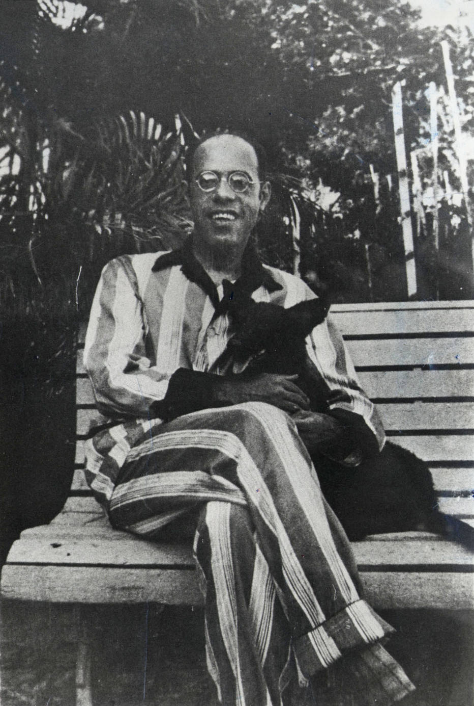

Nem líder-iconoclasta, nem artista revolucionário, nem destruidor anárquico da forma culta da língua; Mário de Andrade foi antes de tudo um homem culto, de múltiplos interesses e um pesquisador de método sério e, por isso, dono de opiniões deliciosamente justas. “A Língua Viva”, publicado pelo Estado de São Paulo em 10 de março de 1940 e reunido em 1972 no “O Empalhador de Passarinhos”, é uma aula de justeza e bom senso a respeito das diferentes vocações da língua culta e popular; de quebra, o texto acaba pondo em panos limpos muitas das polêmicas e dos mitos atribuídos ao mestre de “Os Contos de Belazarte”, aumentados pelos que há muito não pegam mais nas obras originais e que só repetem as opiniões de sempre (pró e contra).

Deixo aqui registrado a transcrição integral do texto como uma homenagem modesta ao artista.

## A LÍNGUA VIVA (1940)

A verdade mais verdadeira deste mundo é que o meu último artigo sobre “A linguagem radiofônica”, jamais eu tive intenção de escrever. Sucedeu porém que no ato de lançar sobre o papel, o artigo que vai aqui, saiu outro. Logo depois de uns poucos metros de escritura, meu pensamento descobriu um atalho, quis saber onde que ia parar e deu naquele abismo ousado da linguagem radiofônica, provocada pelas condições sociais do rádio. Paciência. A honestidade, agora, me obriga a divulgar o que tinha a dizer e não foi dito.

No inquérito sobre o “problema do idioma na radiodifusão”, organizado entre as mais credenciadas instituições culturais argentinas pela Diretoria Geral dos Correios e Telégrafos, eu tive a impressão, tanto pelas perguntas como pelas respostas, que a principal realidade do assunto não entrou nas cogitações de ninguém. Não houve uma clara e realista consciência de que a linguagem usada por milhares de pessoas, já por si diferentes uma das outras e ainda por cima diferenciadas por profissões, situação social, etc., é necessariamente um instrumento vivo, em eterno fazer-se, a que qualquer coisa modifica, transforma ou acrescenta. Ainda mais: não se levou exatamente em conta que, dentro dessa língua total, a linguagem culta funciona mais ou menos como uma língua morta, de tendências necessariamente conservadoras que a fixam pelo estudo e a estratificam pelo cultivo da tradição. A linguagem culta funciona bem exatamente como durante muito tempo funcionou o latim, depois de nascerem e se estabilizarem as línguas românicas: era o instrumento oficial e transcendente, grafado no papel, único usado entre as pessoas cultas nos seus trabalhos de erudição. O indivíduo que dentro de casa e na rua falava o castelhano ou o português vivos, escrevia em latim morto o seu livro sobre botânica. 

Este é muito exatamente o papel da linguagem culta dentro de uma língua. E o indivíduo brasileiro que na rua diz “me parece” ou em casa pede a uma visita: “Se sente, faz favor”, escreverá logo depois “parece-me” e “sente-se”, isto é, uma língua morta estratificada, que ele não se pensa no direito de mudar. Por quê? Porque essa linguagem culta é a língua cujas leis ele decorou no colégio, é a língua estabelecida e fixada pelos clássicos, é a tradição. E ainda existe uma razão mais ponderável: é que a transformação dessa linguagem, as modificações introduzidas individualmente dentro dela, podem se tornar incompreensíveis ou de impossível aceitação por centenas de outras pessoas de outras regiões, pra quem o trabalho também foi escrito. Si eu escrevo umas ideias novas sobre Kant, é certo que não me dirijo ao meu barbeiro e compadre, nem mesmo à minha mãe ou mulher, nem talvez ao meu amigo mais íntimo, dono de todos os meus segredos desde a infância e atualmente corretor de café em Santos. Mas, sem siquer lhes caber o nome, estou me dirigindo a vários professores de Coimbra, a todos os filósofos de língua espanhola que também conhecem o português. Esta é a razão mais ponderável da estratificação e imutabilidade da linguagem culta. É uma língua morta que tira da sua rigidez cadavérica as milhores razões de sua vitalidade. Está muito bem. Mas parecerá imediatamente às pessoas que me conhecem que afirmando estas fáceis verdades, me coloco em enorme contradição comigo mesmo, pois sempre tenho sido em minha vida literária um deslocador, um destroncador, um destruidor dessa linguagem culta, com os meus insuportáveis “erros” de português.

Mas não há contradição alguma. O fato da linguagem culta se assemelhar a uma língua morta e manifestar tendências, algumas falsas e algumas utilitárias, para a estratificação, é apenas uma verdade fácil e preliminar. Outras verficações se ajuntam a essa verdade preliminar, que, à revelia dos indivíduos, obrigam a linguagem culta a ir se modificando com os tempos. O espírito de épocas diferentes, as influências exteriores, as invenções novas, por exemplo, são outros tantos elementos poderosos que modificam cronologicamente a linguagem culta imutável. Uma pessoa de hoje que pretendesse usar a linguagem culta de frei Luís de Sousa, não o poderia fazer – a menos que fosse um pobre de espírito, tão excessivamente pobretão que não tivesse nada a dizer. Porque o pensamento e a sensibilidade de hoje não podem se conter dentro do vocabulário e muito menos dentro do estilo de frei Luís de Sousa. Mas não quero dizer com isto que a linguagem culta se enriquece com os tempos. Ela só pode se enriquecer dentro de uma só época e em relação a esta época. Com efeito, o vocabulário contemporâneo e o estilo atual seriam absolutamente inúteis pra Camões. Si ele os tivesse à mão, antes de mais nada, não seria Camões! Mas imaginando a hipótese que o fosse, isto é, fosse o mesmo gênio que foi, com o sentimento e a cultura do tempo dele, ele deixaria de parte tudo o que possuímos e nos é imprescindível, pra usar apenas o vocabulário e sempre o estilo que criou. O que hoje possuímos não o enriqueceria. 

Além destas circunstâncias sociais que levam a linguagem culta a se modificar com o correr dos tempos, há que não esquecer ainda os imperativos individuais do escritor. Isto é muito importante porque é o que marca melhor a cisão da linguagem culta em duas manifestações profundamente diversas: a linguagem científica e a linguagem artística. Está claro que não é a mesma coisa escrever uma comunicação sobre a moléstia de Chagas e uma poesia de amor. As exigências universalistas da verdade científica obrigam a linguagem culta a se estratificar o mais possível, de forma a ser imediatamente e insensivelmente compreensível a todos quantos a praticam. Ao passo que as exigências individualistas da arte permitem à linguagem artística uma mobilidade extrema. Dentro dela, a simplicidade, por exemplo, não é preceito de Albalat, a que obedecem cegamente apenas os academizantes. A simplicidade não é preceito: é qualidade que uns têm, outro não. Como preceito irrevogável, ela alcança muitas vezes o simplismo e o simplório. Eu aŀrmo que pregar a simplicidade como ideal de perfeição literária e norma objetiva de julgamento de obras de arte... objetivas, é uma penúria. Quando a simplicidade é um atingimento de estilo, como no Machado de Assis do Memorial de Aires, muito que bem: é uma admirável qualidade. Porém se imagine o que seria a simplicidade, mesmo apenas de dicção, para um Dante, um Shakespeare, como pra um Mallarmé e um Stephan George, pra um Euclides da Cunha como um Murilo Mendes. E pra um Kant, de um lado, e pra um Joyce, do outro! Impor a simplicidade como garantia até de profundeza, como faz Sérgio Milliet (O Estado de S. Paulo, 18-XI-44), é simplesmente um academismo. É dormir conformistamente sobre um quarto de dúzia de leizinhas de mestre-escola, sem reverificá-las a cada passo da evolução das individualidades e a cada objetividade de cada obra. O quartanista ginasiano bem-comportado também escreve simples. Não por atingimento porém: por incapacidade. 

E é nisto que residiu a falha principal do inquérito argentino: ele esqueceu totalmente a mobilidade da linguagem culta usada pela arte. Como o inquérito só perguntava sobre a pronúncia culta e as linguagens regionais, familiares ou arrabaldeiras, os respondedores, repudiando ou aceitando estas linguagens, em oposição à linguagem culta, se esqueceram de verificar que é em todas essas linguagens que o artista colhe o melhor da sua expressão literária. Além da sua própria sensibilidade, é na fonte riquíssima de todas as linguagens parciais de uma língua, que o artista vai encontrar o termo novo, o modismo, a expressão justa, a sutileza sintáxica, que lhe permitem fazer da sua linguagem culta, um exato instrumento da sua expressão, da sua arte. E isto é que se faz necessário esclarecer e compreender, porque é a fonte da eterna incompreensão e ridícula briga entre os críticos e censores de um lado e o artista verdadeiro do outro. E é também o que faz evolucionar a linguagem culta. Em vez (ai!), o criticoide pega da poesia ou do conto e o confere pela bitola de Herculano e Garrett. Dá urros. E o próprio artista, levado pelas próprias circunstâncias psicológicas da criação, os seus interesses de ser aplaudido e ser amado pela maioria, foge da expressão nova colhida dos italianos da sua terra, dispensa o termo que lhe deu a criada e que a sua sensibilidade exigia (pois que o lembrou instintivamente), e recoloca o pronome ou em vez de “camarão” diz “bonde”, hesita meio desesperado, mas como está com intenções de lutar por uma cadeira na Academia, acaba corrigindo pra “veículo a tração elétrica”. Esta é a verdade única honesta. A linguagem culta, especialmente quando artística, é também uma língua viva. É mesmo a única língua viva que congraça em sua entidade todas as linguagens parciais de uma língua. E das outras... Ela tem o direito de empregar qualquer voz, qualquer modismo, qualquer sintaxe. As linguagens parciais não têm este direito. Si em São Paulo, falando com minha mana paulista, eu lhe peço que vá na “camarinha” buscar meus chinelos, eu estarei tão anarquista e pedante como si lhe falasse no estilo de Camões. Mas como artista, eu quero o meu direito de empregar “camarinha” no meu conto ou na minha poesia, seja pra efeitos de regionalismo, seja pra efeitos de pitoresco ou de comicidade, ou seja mesmo para efeitos de sonoridade ou de ritmo. E ainda o emprego da palavra pode ser um simples e utilíssimo fato de psicologia pessoal. Viajei pelo Nordeste, lá dormi em muitas camarinhas, lá empreguei a palavra pra me fazer mais imediatamente compreendido, lá sonhei, lá me iludi, lá sofri. A palavra pode pois surgir em mim sem necessidade estilística nenhuma, flor do meu próprio jardim. E eu, como artista, tenho o direito de me expressar com ela. Ela é uma verdade que me liberta e me esclarece. Tudo mais é falsificação e falsidade. Que um português não me compreenda, que um paulista mesmo não me compreenda?.... Eu os forçarei a me compreender si por acaso for um verdadeiro artista.

Post-scriptum – Está claro que nenhuma destas minhas ousadias justifica a ignorância. O escritor é o indivíduo que se expressa pela linguagem alfabética, isto é, a linguagem culta. É preciso, pois, que ele conheça preliminarmente essa linguagem que lhe vai servir de instrumento de expressão. É quasi lapalissada afirmar que só tem direito de errar quem conhece o certo. Só então o erro deixa de o ser, pra se tornar um ir além das convenções, tornadas inúteis pelas exigências novas de uma nova expressão. O resto é academismo, e é interesse pessoal, não da obra de arte.

_Imagem: IEB/USP_
