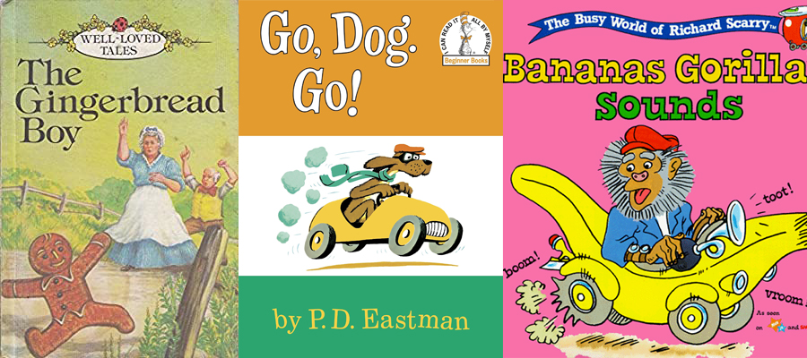

> <small><i>"Pouco tempo depois de ter ido morar com o Sr. e a Sra. Auld, ela gentilmente começou a ensinar-me o A,B,C. Após tê-lo aprendido, ela me ajudou a soletrar palavras de três ou quatro letras...Eu não tinha uma professora fixa (mas)…o primeiro passo fora dado. A senhora, ao me ensinar o alfabeto, tinha me dado a vara e nada podia me impedir de pescar. O plano que eu adotei, aquele pelo qual fui mais bem sucedido, foi o de ficar amigo de todos os meninos que eu encontrava pela rua. O máximo que eu pude, eu os converti em professores. Com a gentil ajuda deles, obtida em momentos e lugares diferentes, eu finalmente consegui aprender a ler."</i> (Frederick Douglass, Narrative of the Life of Frederick Douglass, an American Slave; Auto-biografia)

**
CONTEÚDO:** Preparação para a leitura, escrita, e matemática; 0 - 5 anos
** TEMPO NECESSÁRIO:** Comece com 10 minutos por dia para cada matéria, aumentando gradualmente para aproximadamente 30 minutos por dia até os cinco anos.

Quando você ensina seus filhos em casa, não é necessário estipular o limite entre ser pai e professor. O ensino -- a preparação para os 12 anos de educação formal clássica -- começa após o nascimento.

## PRÉ-ESCOLA: DO NASCIMENTO AOS 3 ANOS

A melhor pré-educação que você pode oferecer ao seu filho é inseri-lo na língua desde o nascimento.

### LEITURA

Desligue a televisão -- meia hora por dia é mais que suficiente para qualquer criança com menos de cinco anos. Converse, converse, converse -- conversa de adultos, não conversa de bebês. Converse com ele enquanto passeiam pelo parque, quando estiverem no carro, quando estiverem fazendo o jantar. Diga a ele o que está você fazendo enquanto o faz.

<i>“Agora eu vou mandar um fax. Eu coloco o papel com a face para baixo e pressiono o número de telefone do aparelho para o qual eu estou ligando...e então o papel começa a sair assim.”</i>

 <i>“Eu derramei farinha no chão. Eu vou pegar o aspirador de pó. Acho que vou usar essa escova -- é a escova de móveis, mas já que a farinha desceu pelos vincos, então deve funcionar melhor que a escova de chão.”</i>

 Esse tipo de bate-papo assenta as bases verbais na mente do seu filho. Ele está aprendendo que as palavras são usadas para planejar, pensar, e explicar; ele está descobrindo como o Inglês organiza palavra em frases, em orações e em períodos completos. Sabemos que crianças de famílias silenciosas (“Nós não conversamos muito durante o dia,” uma mãe nos disse) têm dificuldades com leitura.

 Leia, leia, leia. Comece a ler para o seu bebê no berço. Dê a ele livros para que possa manusear sozinho. (Um ou outro livro rasgado é um preço baixo pela alfabetização). Leia livros ilustrados, apontando para as palavras com o dedo. Leia os mesmos livros várias e várias vezes; a repetição alfabetiza (mesmo que possa deixá-los lentamente loucos). Leia livros mais longos sem imagens enquanto ele senta no seu colo ou corta, cola e colore. Grave sua leitura em áudio, junto com o comentário da criança, para que ela possa ouvi-lo ler várias vezes. Consiga um gravador para que possa ouvi-lo ler, cantar, falar, contar histórias, e recitar poemas enquanto ela brinca no berço.

Após a leitura, pergunte-o a respeito da história. O que o menino de biscoito fez quando a velhinha tentou comê-lo? Ou quando os cachorros chegaram ao topo da árvore ao final de “Vá, cachorrinho, vai”, o que eles encontraram? O que aconteceu após o gorila roubar todas as bananas?¹

 <small>¹Referências, respectivamente, aos livros “Gingerbread Boy” (St. Nicholas Magazine, 1873); “Go. Dog, Go” (P. D. Eastman, 1961) e Richard Scarry’s Bananas Gorilla (Richard Scarry, 1999)
.

<big> 
Tão logo seu filho comece a falar (o que será breve caso ele esteja imerso na língua dessa forma), ensine a ele o alfabeto. Cante a música do alfabeto sempre que trocar a fralda (ou seja, sempre). Cole as letras, tanto maiúsculas quanto minúsculas, na parede ou num quadro. Leia rimas e livros sobre o alfabeto.

Quando ele souber os nomes das letras, diga-lhe que cada letra tem um som, assim como faz cada animal -- <i>“Porcos dizem oinc”, “cachorros dizem au”</i> e <i>“B diz b, b, b assim como em bebê”</i>. Comece com os sons das consoantes (tudo exceto a, e, i, o, u).  Diga-lhe que b é o som do começo de bala, bola e Bruno; diga, <i>“P, p, papai”, “M, m, mamãe”</i> e <i>“G, g, gato”</i>.

E então diga-lhe que as vogais (a, e, i, o, u) são chamadas A, E, I, O e U. Cante, <i>“Seu Lobato tinha um sítio, A, E, I, O, U”</i>. Daí, o ensine que cada vogal tem seu som, assim como cada animal -- <i>“A como em água”, “E como em ela”, “I como em iglu”, “O como em orca”, e “U como em umbigo”.</i> Esses são os sons abertos das vogais, os únicos sons de vogais que você deveria ensinar de primeira. Tudo isso é pré-leitura. 

Preparação de pré-leitura funciona. Susan lia no nível de quinta série no jardim de infância. O filho dela, Christopher, já passava o olho em livros da quarta e quinta série no primeiro ano de aulas em casa. Nós vimos esse resultado replicados por outros <i>homeschoolers</i>. Se você quiser criar um ambiente rico em comunicação, limite a TV e os vídeos, e então ensine os fonemas, você vai produzir leitores.

### ESCRITA

Crianças muito jovens (abaixo de dois anos) vão pegar um lápis e imitar que estão rabiscando. Ensine a criança desde o início a segurar o lápis corretamente. Desenhe vários círculos e voltas no sentido anti-horário. A maioria das letras impressas usam círculos no sentido anti-horário; ainda que muitas crianças naturalmente queiram desenhar círculos no sentido horário, esse hábito dificultará a escrita cursiva mais tarde. Faça em sentido anti-horário homens de neve, Slinkies, fumaças de um trem, rodas de carro, e assim por diante.

Deixe a crianças praticarem as letras sem usar um lápis normal. Uma criança jovem carece de maturidade motora, mas ela pode formar letras e números escrevendo no arroz ou na areia com o dedo. Ou, se ela quiser usar uma ferramenta de escrita, ela pode usar giz num quadro negro ou lápis de cera em grandes folhas de papel. Lápis de diâmetro regular são mais fáceis de serem manuseados pelos dedinhos que os lápis pré-escolares grossos. Ensine ao seu filho de três anos simples habilidades de pontilhamento desenhando sua imagem pontilhada (uma casa, ou rosto sorridente) usando quatro ou cinco pontos grandes, e depois, guiando o lápis de ponto a ponto para que ele possa ver a imagem surgir. Desenhos contínuos e círculos anti-horários vão preparar o aluninho para a escrita do jardim de infância.

### MATEMÁTICA

Comece a fazer o seu filho “matematicamente alfabetizado” nos primeiros anos. Da mesma forma que você deve lê para o seu bebê, cercando-o de linguagem até que ele entenda que palavras impressas carregam significado, você precisa expô-lo aos processos matemáticos e a língua continuamente, só assim ela entenderá que os símbolos matemáticos carregam significado.

Traga os números para o dia-a-dia o máximo possível. Comece contando: dedos, dedões, olhos, ouvidos; brinque de esconde-esconde, contando até cinco e depois até dez, quinze, ou vinte juntos. Conte de dois em dois, de cinco em cinco e depois de dez em dez antes de dizer “pronto ou não, aí vou eu!”. Brinque de espaçonave com caixas de papelão, e faça a contagem regressiva antes de decolar. Leiam livros de números juntos. Assim que ele se sentir confortável contando, você pode começar a trabalhar em simples somas de matemática durante o jardim 1 e jardim 2.

### APRENDIZAGEM GERAL NA PRÉ-ESCOLA

Além de ensinar seu filho a pré-ler e às habilidades iniciantes de matemática, você pode prepará-lo para os trabalhos de jardim de infância usando o livro <i>“Slow and Steady, Get me Ready”</i> de <i>June R. Oberlander’s</i>. É um livro de atividades do nascimento aos cinco anos de idade que oferece novas atividades apropriadas para o desenvolvimento de cada semana de vida. A primeira semana começa com exercícios com os braços e pernas; e termina aos 5 anos, na 52ª semana, aprendendo a fazer uma mala. Nesse meio, Oberlander (um professora do jardim de infância) abarca tudo, desde brincar de esconde-esconde, aprender o que é “dentro” e “fora” ao amarrar os cadarços, memorizar números de telefone, quicar bolas e cantar o alfabeto fazendo diferentes movimentos corporais para cada letra. É uma pré-escola completa em um volume. Talvez você não precise desse recurso, mas ao combinar as instruções de pré-leitura do livro de Oberlander com uma série de jogos ativos, você terá o equivalente de um excelente programa pré-escolar.
