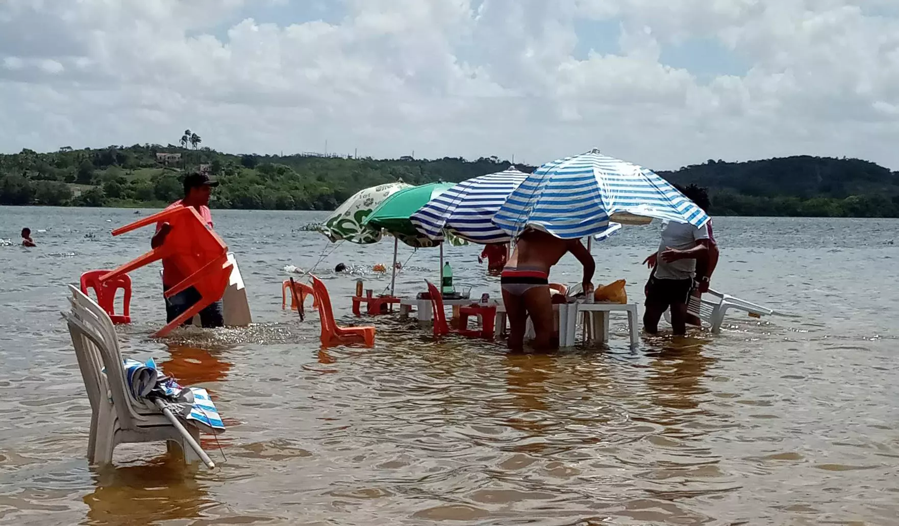
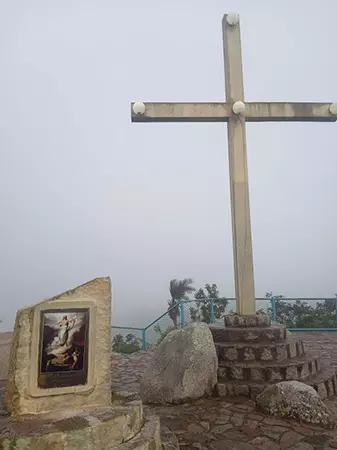

## 03 DE ABRIL

Não é uma gripezinha, é real e está próxima de nós. Nosso governador Renanzinho anunciou com certo orgulho o primeiro óbito pelo Coronavírus aqui em Maceió, no bairro do Trapichão. Estamos agora conectados ao mundo. Mas esse não pode ser o único caso, simplesmente porque não há testes aqui para o Corona. Quantas pessoas já devem ter morrido anonimamente pela gripe antes da quarentena? E quantas outras vêm trabalhando nos ônibus que ainda circulam, nos supermercados, nas festinhas de condomínio para que o vírus se espalhe? E quanto tempo levará para que os únicos automóveis em circulação sejam as ambulâncias e os circulares cheios de moribundos do interior?

 Não temos um <i>Winston Churchill</i> na presidência, temos só o Bolsonaro; e a praga pra ele é só mais um inimigo dentre os vários outros que querem derrubá-lo. Mas, infelizmente, é da caneta dele que saem os decretos publicados em Brasília quase diariamente. O que se diz por aí é que a quarentena se extenderá e que estamos longe do pico de incidência do vírus. Enquanto isso as pessoas enlouquecem aos poucos em casa, os calotes multiplicam e o comércio lentamente quebra. Na escola onde eu trabalho, já está se ventilando a suspensão dos contratos e redução do salário. É só o governo sinalizar. Dizem que o trabalhador informal receberá do governo R$ 600 por dois meses, mas acho isso um improvável. Quem vai dizer quem é informal ou não? e o dinheiro, cai na conta de quem?

## 06 DE ABRIL

Impossível não fundir o motor do cérebro ao interpretar o show de contorcionismo academiquês-vazio no enunciado do primeiro fórum online de “Fundamentos Filosóficos da Pedagogia”. Leia:

> <i>Considerando a importância dos fundamentos filosóficos para compreender e distinguir melhor as mudanças que ocorrem no âmbito do processo educacional, é correto afirmar que, ao refletir na dimensão dos Fundamentos Filosóficos da Educação, no ambiente de trabalho, torna-se condição ímpar verificar esses aspectos crítico-reflexivos. A dimensão conceitual tem significado para o trajeto e reconhecimento no âmbito da escola e na formação docente, sendo muitas vezes seu foco uma questão singular no dinamismo, que merece uma atenção atenta do educador.</i>

Por que não dizer apenas: conhecer os fundamentos filosóficos da educação é algo importante para o professor? Beleza que a minha frase não é a mais bem escrita do mundo mas, sem dúvida, é mais curta.

 Depois de ler a apostila que fizeram para a mesma disciplina, impossível também não lembrar da lição que o <i>Mortimer Adler</i> nos ensina no “A Arte de Ler”. Diz ele que uma forma de identificar o quão picareta é um professor é medir o quão distante ele está da fonte primária dos autores da sua área. Isso significa que, se seu professor te dá apostilas e não as fontes primárias ele está, na verdade, te blindando de uma fonte de conhecimento que nem ele domina. E é exatamente o que temos aqui: uma apostilinha à toa com <i>design</i> lúdico e que mais parece livro do MEC. No texto, muito <i>name-dropping</i>, muita referência a professores locais e termos mal explicados por alguém ouviu de alguém, que ouviu de alguém...

## 15 DE ABRIL

É madrugada de terça pra quarta, ainda estamos de quarentena e estou bêbado por um bom motivo. Aos poucos o “Subsidiário” ganha forma pelas mãos de Laís. Mal sabe ela que aos poucos, ela dá forma à minha vocação e à dela. Depois de hoje, justamente no dia em que completamos quatro anos de namoro, sei que nunca mais seremos os mesmos. Amo ela, e não posso me esquecer disso.

## 19 DE ABRIL

Não consigo dizer quando foi exatamente que dormir se tornou um problema pra mim. Lembro que foi muito difícil me adaptar ao sol de Maceió, quando os primeiros raios despontavam às quatro e pouca da manhã no quartinho apertado na pensão da Rosália. Nesses dias só conseguia dormir mesmo às 8 ou 9 horas. É que para mim o sol era o sol de Minas, que sempre nasceu depois das seis da manhã. Até lá se tinha muita madrugada pela frente, madrugada de álcool, de filmes, de cigarros….mas aqui é diferente. A madrugada em Maceió é curta e frágil, lá pelas quatro e pouco da manhã a aurora se derrama em luz sobre o céu azul anil.

 O maceioense já vive em acordo com o Sol, dorme cedo e acorda cedo, e quem tá certo é ele. O boêmio e o notívago se ferram, ou marcam a farra pra mais cedo ou amargam um belo Sol na cara inchada...o que é uma forma bem deprimente de voltar pra casa ainda que a praia fique lindíssima ao amanhecer

 A pior coisa do mundo é ficar sem dormir. Na minha vida já varei tanta noite por besteira que hoje me parece loucura sujeitar a tanto sofrimento por nada. Porque não há nada que justifique uma noite sem dormir, nada: nem prova da facul, nem uma apresentação importante, nem o melhor emprego do mundo. Uma noite sem dormir é pior que a morte, é a vontade de morrer. Fiz a mim mesmo a promessa que nunca mais passaria uma noite sem dormir, nem que pra isso tenha que encher a minha cara de qualquer remédio. 

 Já tomei Dramin várias vezes antes de vir para Maceió. A primeira vez foi em 2010, quando viajei para tocar com a Lupe, no caminho de BH a Mato Grosso. Tomei sem maldade, adormeci e numa parada de estrada, enquanto todo mundo descia do carro, eu não conseguia mais me mexer. Desde então foi uma longa viagem. 

 Talvez seja porque não tinha nada que prestasse na cabeça, mas sempre dormi bem e despreocupado em Belo Horizonte, mesmo quando dividia uma cama de solteiro com minha ex-namorada. E o sono sempre vinha leve e gostoso, na hora em que a gente precisava. A primeira vez que comprei uma cartela de Dramin foi em 2015, na minha ridícula passagem por São Paulo. Na época eu viajava muito de ônibus e o Dramin funcionava como uma pílula de teletransporte, eu engolia, e um capítulo de <i>kindle</i> depois, pronto...acordava em BH ou em Uberlândia. Mas o bicho pegou mesmo em Maceió. E não quero culpar o Astro-rei pelo meu vício mesmo porque já me declarei vencido por Ele. 

 Tenho sentido uma dorzinha caminhante sobre a minha cabeça, talvez por ter dormido essa semana alternadamente sob o efeito do Dramin ou sob o efeito de cinco latas de Original. A sexta para o sábado foi o estopim: tomei cerveja e ainda por cima um comprimido. Fui dormir bêbado e artificialmente cansado, mas confiante porque teria 5 horas de sono, um sucesso. Eram duas e tanto e tinha que acordar às sete e tanto. Mas acabei despertando 20 minutos depois, sem nenhum vestígio de cansaço, totalmente agitado. Antes de me desesperar, tomei outro Dramin que mantenho escondido em cima do armário da área de serviço. Laís ficou horrorizada. No dia seguinte, ela, na sua sabedoria infinita de mulher, sugeriu que começasse a escrever sobre essa minha relação de medo e dependência dessa pilulazinha rosa. Acho que ela tava certa.

## 1º DE MAIO

Tenho uma coisa a confessar, querido Subsidiário: furei a quarentena hoje, no dia do trabalhador. Fui a uma festinha de amigos, um <i>rendez-vous</i> na Ponta Verde. Éramos cinco, tomei cerveja e meio doce. Ouvi <i>John Zorn</i> pela primeira vez, os vizinhos e o porteiro passaram pano por cima do barulho. Será que fiz errado?

 A resposta de Deus veio na forma de uma chuva horrível que me fez ficar ilhado por horas. Graças a Ele, todavia, consegui voltar pra casa são e salvo. Pra terminar a madrugada, Laís e eu assistimos travados ao novo filme do <i>Tarantino, "Once Upon a Time...in Hollywood"</i> enquanto despontava o primeiro sol de maio. Filme leve e divertido, nada a reclamar.

## 04 DE MAIO

Tive uma ótima conversa por vídeo com o Rodrigo Cobra, um amigo meu de Minas e que hoje trabalha no RenovaBR, uma organização que é como se fosse uma escola para formação de políticos, uma ideia interessante. O Cobra sempre foi um cara muito bom de papo, e, como pude contestar da última vez que conversamos em 2018 no Carnaval de Olinda (pior situação, impossível) ele é também muito inteligente, curioso, sedento por conhecimento. Lembro que o Cobra me pareceu na época um pouco perturbado, desinquieto, como se ele estivesse prestes a dar de cara com um abismo, prestes a mudar toda uma concepção que ele tinha até então. Estaria ele flertando com ideias conservadoras, talvez?

Durante quase três horas de conversa, Cobra me falou um pouco da quarentena em São Paulo e mostrou um pouco sobre o trabalho dele e o que ele descobriu sobre ensino durante a experiência no RenovaBR; ele me mostrou o perfil do João Malheiro, professor do Rio que eu não conhecia. Falamos sobre o caos que é o ensino público e privado no Brasil e minha tentativa fuleira de auto-educação. Falei pra ele sobre o "Subsidiário". Senti, finalmente, no Cobra, alguém que entende do que eu sinto.

Falando nisso, o "Brasil Paralelo" transmitiu essa semana uma série de discussões ao vivo bem boas sobre educação domiciliar, ou Homeschooling, com depoimentos de famílias que praticam a modalidade com seus filhos aqui no Brasil.
Não me entendam errado, eu apoio em 110% o Homeschooling. Esses pais que dão a cara a tapa são heróis, são pontas de lança contra a ignorância geral da nossa elite, e merecem nossa total admiração; e o Brasil Paralelo, todo o nosso respeito pela coragem de encampar essa bandeira. Mas, infelizmente, não posso deixar de registrar algumas impressões que tive após assistir à discussão.

**1) Tentar convencer pais a fazerem Homeschooling é inútil.**

Isso me lembra aquela anedota que foi contada pelo David Foster Wallace no <i>“This is Water”</i>, em que um peixe mais velho, saudando outros dois peixinhos que nadavam na direção contrária, dizia: “bom dia, meninos! como vai a água?”. E depois de nadarem um pouco, um dos peixinhos olha pro outro e pergunta: “o que será que ele quis dizer com ‘água’?”

 Em outras palavras, não dá pra convencer alguém de um problema que para os outros é invisível. Se os pais não perceberam em que água estamos imersos -- água parada e suja, turva de tanto veneno -- não há nada que se possa fazer. E é por isso que o <i>Homeschooling</i> não é algo que possa ser explicado, nunca haverá entendimento entre convertidos e gentios. Estamos falando de visões de mundo radicalmente opostas e talvez incompatíveis: enquanto os pais do homeschooling sonham em oferecer uma formação de conteúdo “Universal”, mais próxima ao seio da família -- ainda que nem sempre sejam bem sucedidos nessa empreitada; os pais da classe média estão satisfeitos em gerarem bacharéis ou concurseiros, e não se importam que todo o dinheiro que eles ganhem na vida seja drenado para isso. E depois reclamam que os professores só ensinam marxismo pros seus filhos.

 Quando alguém tenta argumentar contra o <i>Homeschooling</i>, surge sempre a “carta” da sociabilidade: “E a convivência com as outras crianças?” como se a escola não estivesse se tornando, na melhor das hipóteses, um local para que as crianças possam assistir vídeos de celular em grupo, ou ainda, nas piores, um presídio de crianças em regime semi aberto.

 Eu, quando frequentava a escola, tinha um grupo muito sólido de dois ou três amigos, e que perpassou por anos a fio. Convivíamos apenas entre nós mesmos, fazíamos os trabalhos juntos e, de tarde, íamos pra casa um do outro brincar de bola (sempre fui perna de pau) e falar de meninas...os 500 alunos restantes eram paisagem para nós durante o recreio.

Até onde eu sei, os romances e as memórias dos escritores brasileiros sobre o tempo de internato geraram obras sobre deslocamento e solidão, vide “O Ateneu”, “Doidinho” e “Infância”...

**2) Não sei se sou mais a favor do <i>Homeschooling</i> que da autoeducação.**

No final das contas, o <i>Homeschooling</i> é um nome novo (pelo menos pra nós) para a a técnica mais antiga do mundo que é a de educar os próprios filhos. Já vi várias pesquisas científicas super sofisticadas que chegam à conclusão mais óbvia de todas: a de que o nível cultural e moral dos filhos depende do nível cultural e moral dos pais ou seja lá quem os filhos estiverem convivendo a maior parte do tempo. Isso significa que quase todo o investimento feito em educação pública e privada é inútil porque o grosso da personalidade da criança é desenvolvida nos momentos de distração, onde ela absorve silenciosamente os hábitos dos adultos ao redor.

Isso me lembra uma cena que vi quando caminhava com a Laís na orla daqui de Ponta Verde, uns meses atrás. Certa hora, um carro parou no semáforo fechado; lá dentro havia um casal nos bancos da frente e no de trás, uma menina bem pequena. Se não me engano, acho que a menina estava ajoelhada no banco de trás, apoiada contra a porta e olhando pra nós...de qualquer forma, dos alto falantes daquele carro soava uma música muito alta que dizia:

“E a pepeca, poc, poc, poc….”

Ou algo parecido com isso.

Não tenho nada contra música popular, nada contra a swinguêra -- é assim que se chama o estilo de música daquele dia -- e muito menos contra a pepeca, mas, a gente sabe que não há educação liberal que entre na cabeça de uma criança que escuta o “poc poc” em casa.

Conclusão óbvia: a qualidade do Homeschooling vai depender da qualidade dos pais. E se o Homeschooling é apenas um nome e não a educação em si, nada impede que nas mãos de picaretas ele se torne uma grife, uma marca a explorar a consciência de pais assustados. É possível ainda que daqui a um tempo existam pais especializados em homeschooling dos filhos alheios. E quando a gente menos esperar: bum! temos novas escolas, caríssimas e inacessíveis. Sem dúvida, não sei se essas escolas conseguiriam ser piores do que as de hoje, mas, sem dúvida, elas podem ser tão caras quanto as escolas particulares de hoje.  

O que eu quero dizer é que educação não precisa ser uma coisa cara, você só precisa de alguns livros e uma pessoa inteligente que possa ensinar algo. Ficar repetindo que o Homeschooling como salvação de tudo me soa como cair no mesmo caipirismo brasileiro de ficar de quatro para a primeira novidade que vem de fora.

**3) Eu seria um péssimo professor para o meu filho.**

 Fico imaginando o que eu vou fazer no dia que eu for pai. Não sei se teria a energia para sentar e “bolar” diariamente as atividades para os meus filhos, especialmente se eu estiver trabalhando em escolas, oito horas por dia. Como faria as atividades extraclasses? Logo eu que quase não saio de casa e que tenho pouquíssimos amigos. Levaria ele, talvez pra biblioteca do Sesc-Poço e pra Graciliano Ramos de vez em quando. Talvez levaria ele (ou ela, claro) pro interior, pra Penedo e pra Água Branca para mostrar-lhe as igrejas  do período colonial  -- claro que teria que estudar sobre tudo antes. Na volta, passaríamos por Delmiro Gouveia, Marechal Deodoro pra mostrar-lhe a casa do primeiro presidente da República e a casa do Floriano Peixoto em Ipioca (nunca fui em nenhum desses lugares). Será que não seria mais eficiente dar a ele um descanso das aulas maçantes e dos professores neuróticos e mostrar-lhe pelo exemplo que eu, assim como ele, também estou tentando entender alguma coisa sobre este mundo?

Não quero desanimar ninguém porque eu, confesso, padeço às vezes do mal do pessimismo preguiçoso. Se você estiver afim de ser o professor oficial de seus filhos, parabéns! você provavelmente vai entrar numa das viagens mais recompensadoras da sua vida e, certamente, vai se surpreender várias vezes enquanto seu próprio potencial como pai e ser-humano. Já seus filhos, estes serão os seres mais amados e emocionalmente bem resolvidos que emergirão desse brejo de almas que é o Brasil.

## 10 DE MAIO

Pelo que me parece a quarentena está mesmo absolutamente desmoralizada pela população, pelo menos lá em Uberlândia. Minha fonte é seguríssima, é a minha mãe, Dona Cleides, que me contou por telefone que, enquanto dava a sua voltinha no domingo do dias das mães, viu uma penca de gente sem máscara fazendo exercício na parte externa do Parque do Sabiá, já que o parque estava fechado. 
Não sei até quando os decretos chineses vão segurar as pessoas nas casas, já que até agora foram registradas “apenas” 9 mortes, numa cidade de quase setecentos mil habitantes. Aqui em Maceió a situação é um pouco diferente, tivemos até agora 126 mortes e somos 930.000 habitantes com costumes bem diferentes. Mas, apesar de ser proporcionalmente maior, os números de Maceió também não me parecem muito altos pelo tamanho da cidade. Tenho certeza que deve estar um inferno nos hospitais com superlotação, o perigo de infecção e tudo mais. Mas, por outro lado, os hospitais não estão preparados para servirem a todos nem em momento de paz, quanto mais numa pandemia. Enfim, sei de nada...estou confuso.

## 13 DE MAIO

Em vez do 13 de maio, celebramos um vago dia da consciência negra, e por quê? Não quero desmerecer nem uma gota do heroísmo do nosso Zumbi dos Palmares, herói de todos nós, mas se não fosse pelo Getúlio Vargas abolindo a data do nosso calendário de feriados -- algo que nem os republicanos tinham lembrado de fazer -- e o 13 de maio estaria hoje muito mais vivo no coração das pessoas que o 20 de novembro.

De certa forma ele ainda está residualmente. Na escola, lembro de ter colorido (ou será que foi meu irmão, Danilo?) a pele de ex-escravo desenhado em papel de mimeógrafo. No desenho, o negro liberto quebrava as correntes, lançando estilhaços por toda a página, sobre um laço onde estava escrito: “Dia 13 de maio de 1888, dia da Abolição da Escravatura”.

Esse mesmo 13 de maio que segundo o Rubem Braga mais parecia um conto de fadas -- em que uma princesa assina com uma pena de ouro uma linha que liberta toda uma raça -- é visto hoje com aquela ironia ignorante que resolve tudo na base do jargão. Daí que o Luciano Huck, mostrando que aprendeu direitinho os lugares comuns dos seus pares, disse hoje no “Diário de Pernambuco” que a Lei Áurea foi apenas a abolição “cartorial” da escravidão. E o jornal publica isso, cagando em cima da nossa história, da cabeça do Joaquim Nabuco e dos milhões de filhos de negros e mestiços que hoje chamamos de brasileiros.

## 14 DE MAIO

Li hoje uma fala interessante no filme <i>Insomnia</i> com Al Pacino. Uma das personagens que era a dona de uma pousada no Alasca disse algo que associei tropicalmente à minha vida aqui em Maceió. Dizia ela que, na cidadezinha onde morava, existiam dois tipos de pessoas: as que nasceram ali e as que estão fugindo de alguma coisa.

## 10 DE JUNHO

Meu Deus, como eu fiz minha mãe gastar dinheiro à toa em aulinhas de inglês! Esse é o pensamento que me vem agora deitado na cama, com as costas fudidas depois de dar sete horas de aulas online de Inglês. Que ironia! Fiz ela moer uns bons milhares de reais em aulinhas a que eu chegava pontualmente 40 minutos atrasado, e no Cultura Inglesa ainda, o mais caro de Uberlândia! Se ela soubesse que o grosso do idioma aprendi mesmo foi assistindo <i>"Friends"</i> e séries americanas na <i>MTV</i>, talvez ela teria usado do dinheiro pra financiar uma casa pra ela na praia. Seria melhor, com certeza. Lembro que às vezes, quando ela entreouvia meus irmãos e eu falando algo em inglês, ela dizia, como que para se autojustificar do esforço: “viu, como é bonito saber Inglês?” Outras vezes, sempre que eu e ela éramos chamados pela Cultura Inglesa para pegar os boletos atualizados com os preços do semestre seguinte, minha mãe, na hora de assinar o contrato, acabava soltando: “já gastei um carro nesse inglês”. Numa dessas idas, a coordenadora do Cultura, uma senhora elegantérrima super maquiada, olhou pra mim e me perguntou como que selando o pacto tácito no melhor estilo “me ajuda que eu te ajudo”:

-- “Well, hey, Darling! What have you been doing on your vacation? 

E eu, adolescente gordinho e tímido, só respondi: 
-- “Nothing...I’m a couch potato!”.

I’m a couch potato: muletinha mais safada e que deve ter entrado por acidente na minha cabeça...Mãezinha, me desculpe! Teria que trabalhar dois anos diretos só pra te restituir esse dinheiro suado que a senhora tirava como caixa do Banco do Brasil.

Mas só pra não dizer que foi tudo em vão, lembro com carinho dos momentos de recreação no pátio do Cultura Inglesa, um momento mágico onde eu podia ver as meninas ricas de Uberlândia, as meninas que frequentavam o Praia Clube (o qual eu não era sócio) e que eram, geralmente, de um outro patamar de beleza a qual eu não estava acostumado a lidar no meu colégio de bairro.

Havia também um professor, o Luís, um cara muito gente boa, e que teve um impacto enorme simplesmente por que ele me elogiava muito. Ele falava assim de um jeito bem protestante e pouquíssimo brasileiro: <i>“I can’t believe how successful you’ll be!”</i>. Eu nem precisava falar nada de muito profundo e ele já mandava: <i>“Cícero, I can’t believe how successful you’ll be!”</i> Muito obrigado, Luís! você não sabe, mas hoje em dia, sempre que eu estou me sentindo um lixo, um <i>couch potato</i>, eu ainda me lembro desse gesto de confiança cega. <i>“I can’t believe how successful you’ll be!”</i>. Algumas coisas não tem preço mesmo.

## 26 DE JUNHO

Acabo de terminar a última bateria de provas do primeiro semestre do curso de Letras da UPE à distância. Das seis disciplinas, apenas duas foram conduzidas com seriedade pelos professores e tutores: a de Língua Latina e a de Metodologia Científica. As demais ou foram disciplinas interessantes mas impossíveis de serem compreendidas porque o material didático é ruim e os tutores não são grande coisa, ou foram disciplinas apenas banais; aí não faz diferença mesmo. O problema é que tudo toma o nosso tempo, nosso precioso tempo que melhor seria melhor investido na pesquisa desinteressada daquilo que realmente nos interessa. É a tal da coisa, a melhor forma de fazer um curso superior é não deixar que ele tome tempo do nosso estudo.

